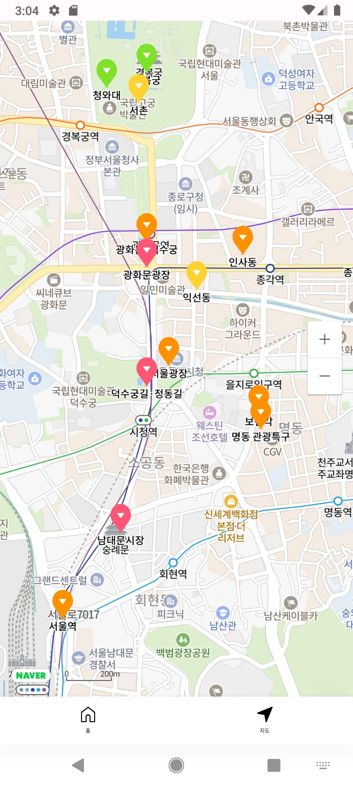
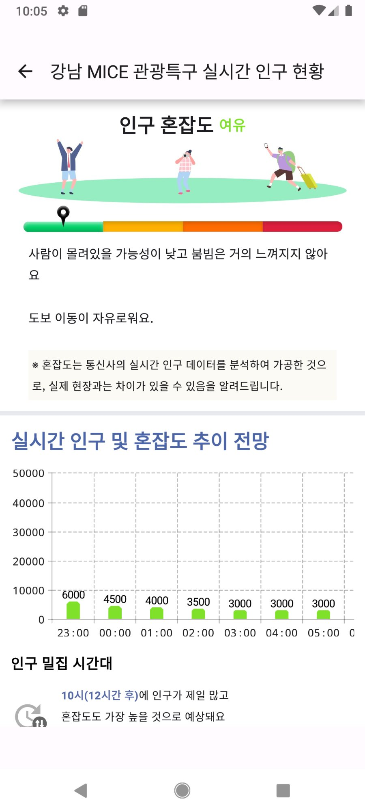
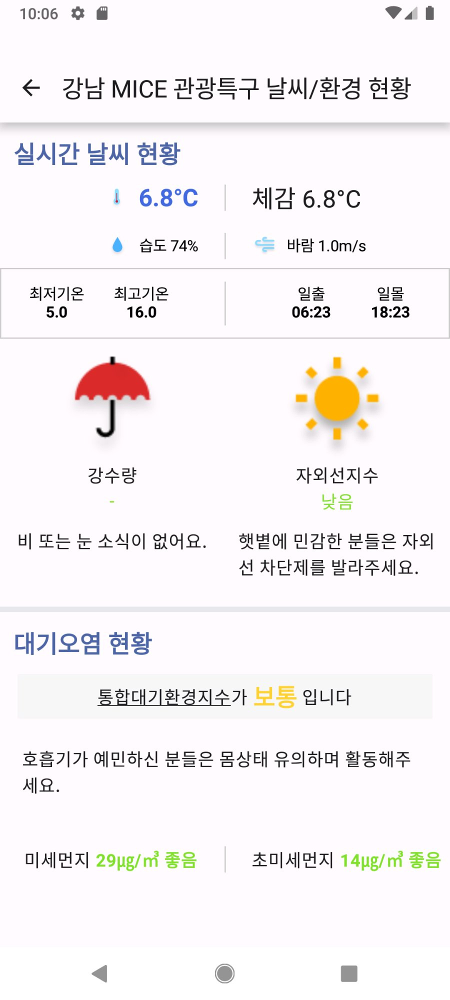
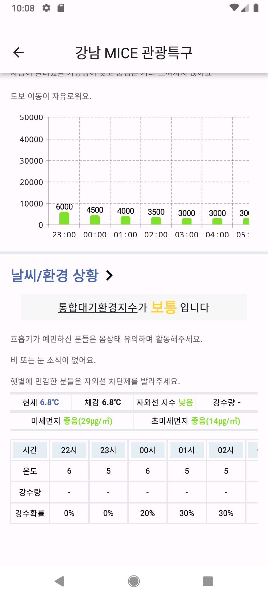
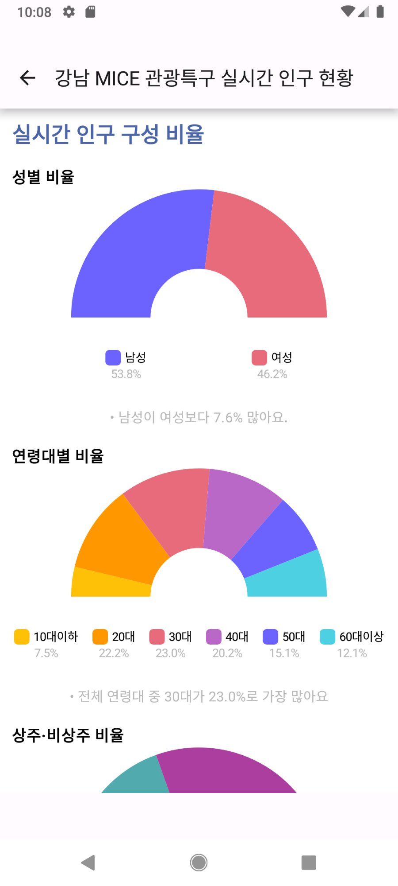

# 🗺️ 서울맵 (SeoulMap)

> 서울시 공공 API를 활용한 실시간 인구 분포 및 환경 정보 안드로이드 앱

서울시 110+ 지역의 실시간 인구 밀집도와 날씨·대기질 정보를 시각적으로 제공하여, 사용자가 혼잡도를 피하거나 쾌적한 지역을 선택할 수 있도록 돕는 서비스입니다.

---

## 📱 주요 화면

| 메인 홈 | 지도 뷰 | 검색 |
|:---:|:---:|:---:|
|  |  |  |

| 지역 상세 — 인구 | 지역 상세 — 환경 |
|:---:|:---:|
|  |  |

| 인구 추이 차트 | 인구 구성 차트 |
|:---:|:---:|
|  |  |

---

## ⚙️ 주요 기능

- **실시간 인구 밀집도 시각화** — 서울시 110+ 지역 인구 데이터를 네이버 지도 위에 마커로 표시
- **지역 상세 정보** — 마커 클릭 시 인구 현황, 날씨, 대기질 정보 제공
- **데이터 시각화** — MPAndroidChart를 활용한 시간대별 인구 추이 및 구성 차트
- **검색 기능** — 지역명 기반 검색 및 필터링
- **카드뷰 + 지도뷰** — 다양한 탐색 방식 제공

---

## 💡 기술적 개선

### State Hoisting 패턴 적용
- 기존 7개 Composable 파일을 1개로 통합하여 코드 구조 개선
- **객체 생성 25% 감소**, **메모리 사용량 10% (880KB) 개선**

---

## 🛠️ 사용 기술

| 카테고리 | 기술 |
|:---|:---|
| Language | Kotlin |
| UI | Jetpack Compose |
| Architecture | Clean Architecture, MVVM |
| Networking | Retrofit, OkHttp |
| Async | Coroutines, Flow |
| DI | Hilt |
| Map | Naver Maps SDK |
| Chart | MPAndroidChart |
| Local Storage | DataStore |

---

## 📂 프로젝트 구조

```
├── data
│   ├── api          # Retrofit API 인터페이스
│   ├── dto          # 서버 응답 DTO
│   └── repository   # Repository 구현체
├── domain
│   ├── model        # 도메인 모델
│   ├── repository   # Repository 인터페이스
│   └── usecase      # UseCase
├── presentation
│   ├── home         # 메인 화면
│   ├── map          # 지도 화면
│   ├── detail       # 상세 화면
│   └── search       # 검색 화면
└── di               # Hilt 모듈
```

---

## 🏃 실행 방법

1. 프로젝트 클론
```bash
git clone https://github.com/arab1209/Realtime-Population.git
```

2. `local.properties`에 API 키 추가
```
NAVER_MAP_CLIENT_ID=your_client_id
SEOUL_API_KEY=your_api_key
```

3. Android Studio에서 빌드 및 실행
